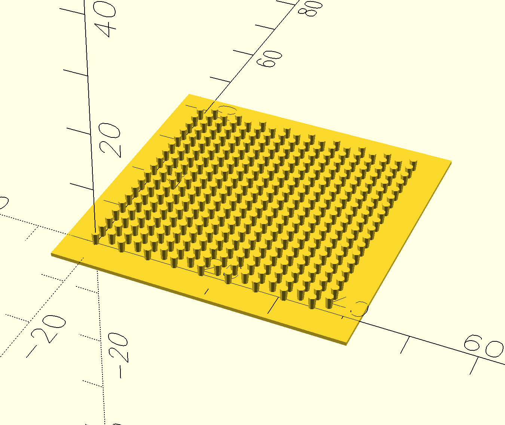

# 3D-Printable Parametric Velcro Generator



[YouTube](https://www.youtube.com/watch?v=5rzHbZ7zt-w)

A parametric velcro generator for 3D printing, created in OpenSCAD. This project allows you to create customizable velcro strips of various sizes and characteristics.

## Description

This project represents an improved version of a 3D printable velcro generator. Based on the original work by MM Printing and subsequent remixes, this generator offers:

- **Full parameterization** - all dimensions and characteristics are customizable
- **Optimized geometry** - improved tower shape for better grip
- **Flexible settings** - ability to adjust density and grip strength
- **Ease of use** - intuitive parameters

## Features

### Customizable parameters:

- **Tower dimensions**: base diameter, height, top diameter
- **Pattern dimensions**: width and length of velcro with automatic ratio adjustment
- **Base plate**: thickness and borders
- **Print quality**: resolution and preview mode
- **Grip strength**: interference adjustment between elements

### Key improvements:

- **Automatic dimension adjustment**: The velcro pattern has a 2:1 ratio (width:height), so for square results, the length is automatically doubled when `Auto_adjust_dimensions` is enabled
- **User-friendly**: No need to manually calculate the correct dimensions
- **Flexible**: Can be disabled for custom ratios

### Technical characteristics:

- Automatic calculation of optimal element placement
- Support for various sizes (from 10x10 mm to 500x500 mm)
- Adjustable rendering quality
- Informative parameter output to console

## Usage

### Requirements:

- OpenSCAD (recommended version 2021.01 or newer)

### Instructions:

1. Open the `3d-printable-velcro.scad` file in OpenSCAD
2. Adjust parameters in the "Customizer" section or modify variable values
3. Press F5 for preview or F6 for rendering
4. Export to STL format for printing

### Recommended print settings:

- **Layer height**: 0.2-0.3 mm
- **Infill**: 20-30%
- **Supports**: not required
- **Cooling**: enabled
- **Print speed**: 40-60 mm/s

## Parameters

### Velcro towers:

- `Base_diameter` - base diameter of tower (0.5-5 mm)
- `Height_multiplier` - height multiplier (1.0-4.0)
- `Top_multiplier` - top diameter multiplier (1.1-2.0)
- `Interference` - grip strength adjustment (-10 to 10)

### Pattern dimensions:

- `Width` - velcro width (10-500 mm)
- `Length` - velcro length (10-500 mm)
- `Auto_adjust_dimensions` - automatically adjust length for proper velcro pattern ratio (recommended: true)

### Base plate:

- `Thickness` - base plate thickness (0.2-5 mm)
- `BorderH` - horizontal border offset (1-100 mm)
- `BorderV` - vertical border offset (1-100 mm)

### Quality:

- `Resolution` - cylinder resolution (5-100)
- `Preview_mode` - preview mode (true/false)

## Usage Examples

### Small velcro for electronics:

```
Width = 20;
Length = 20;
Base_diameter = 0.8;
Height_multiplier = 2.5;
```

### Large velcro for furniture:

```
Width = 100;
Length = 50;
Base_diameter = 2.0;
Height_multiplier = 1.8;
```

### Dense velcro for clothing:

```
Width = 30;
Length = 30;
Base_diameter = 1.2;
Height_multiplier = 3.0;
Interference = -5;
Auto_adjust_dimensions = true; // Length will be automatically doubled to 60mm
```

### Custom ratio velcro:

```
Width = 40;
Length = 80;
Base_diameter = 1.5;
Auto_adjust_dimensions = false; // Use exact dimensions without adjustment
```

## License

This project is based on original work under CC0 Public Domain license. This version is distributed under Creative Commons Attribution-NonCommercial 4.0 International license.

## Authors

- **Original work**: Amarjeet Singh Kapoor
- **Parametric version**: MM Printing
- **Improvements and remix**: Greg Kolens

## Links

- [Original model on Printables](https://www.printables.com/model/33302-printable-velcro)
- [MM Printing parametric version](https://www.printables.com/model/543802-printable-velcro)
- [Parametric SCAD version](https://www.printables.com/model/568587-parametric-3d-printable-velcro)

## Support

If you have questions or suggestions for improving the project, create an issue in the repository or contact the author.

---

**Note**: Print results may vary depending on printer settings, material, and model parameters. It is recommended to conduct a test print to optimize parameters for your needs.
